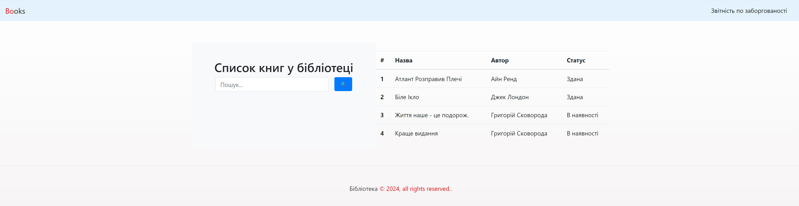
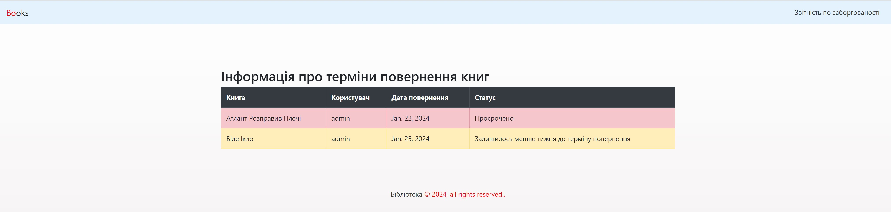

# Бібліотека

Цей Django-проект реалізує систему управління бібліотекою.

## Встановлення

1. Створіть та активуйте віртуальне середовище:

```bash
python -m venv venv
source venv/bin/activate
```
2. Встановіть залежності:
```bash
pip install -r requirements.txt
```

3. Виконайте міграції:
```bash
python manage.py makemigrations
python manage.py migrate
```

4. Запустіть сервер розробки:
```bash
python manage.py runserver
```

Сервер буде доступний за адресою http://127.0.0.1:8000/books/


А за адресою http://127.0.0.1:8000/overdue-books/

Можна отримати інформація про термін повернення книг.
